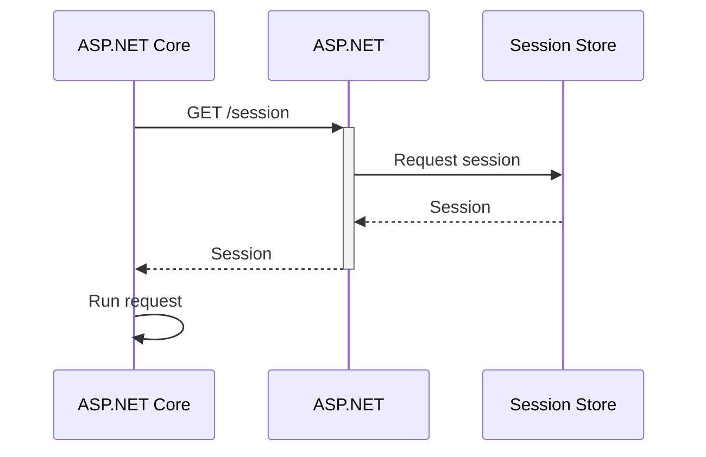
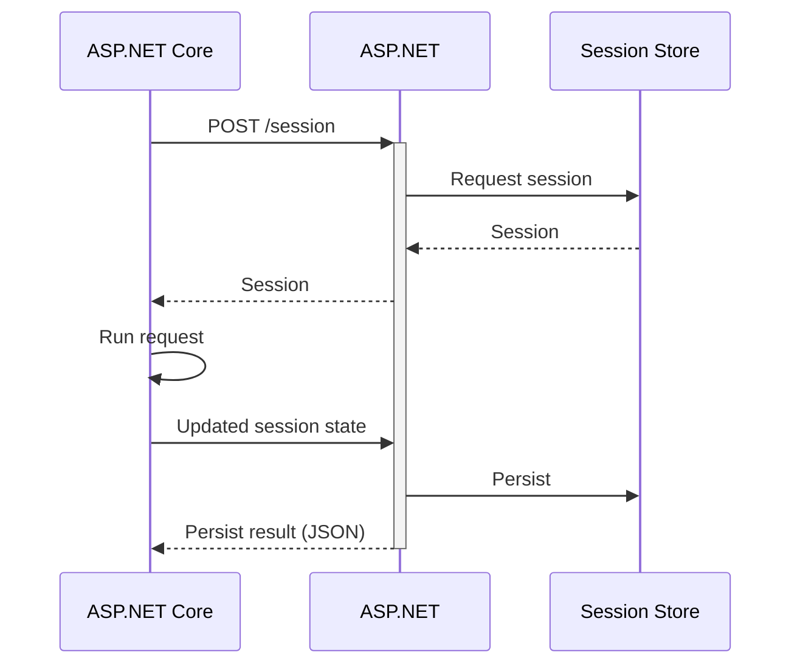
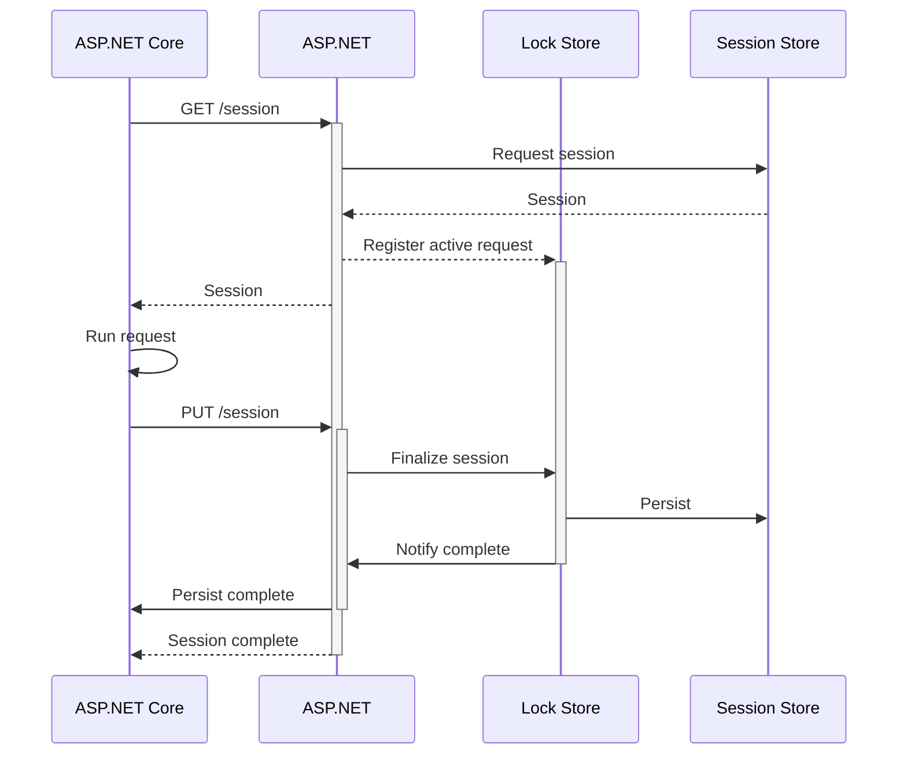

# Remote session Protocol

## Readonly

Readonly session will retrieve the session state from the framework app without any sort of locking. This consists of a single `GET` request that will return a session state and can be closed immediately.

## Writeable (single connection with HTTP2 and SSL)

Writeable session state protocol consists of a `POST` request that requires streaming over HTTP2 full-duplex.

## Writeable (two connections when HTTP2 or SSL are unavailable)

Writeable session state protocol starts with the the same as the readonly, but differs in the following:

- Requires an additional `PUT` request to update the state
- The initial `GET` request must be kept open until the session is done; if closed, the session will not be able to be updated
- A lock store (implemented internally as `ILockedSessionCache`) is used to track active open requests

