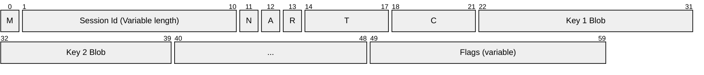
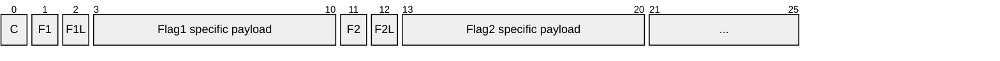
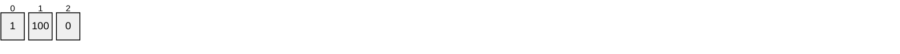
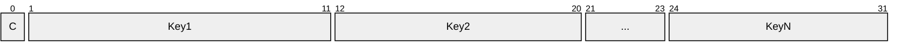

# Session serialization

Session serialization is provided through the `ISessionSerializer` type. There are two modes that are available:

> [!NOTE]
> The bit offsets are general guidelines here to show the layout. The diagram tool does not have an option to turn it off at the moment. See the descriptions for details on bit-length

## Common structure

Where:
- `M`: Mode `byte`
- `N`: New session `bool`
- `A`: Abandoned `bool`
- `R`: Readonly `bool`
- `T`: Timeout `7-bit encoded int`
- `C`: Key count `7-bit encoded int`

## Flags

Flags allow for additional information to be sent either direction that may not be known initially. This field was added v2 but is backwards compatible with the v1 deserializer and will operate as a no-op as it just reads the things it knows about and doesn't look for the end of a payload.

Structure:

Where:
- `Fn`: Flag `n`
- `C`: Flag count `7-bit encoded int`
- `Fn`: Custom identifier `7-bit encoded int`
- `FnL`: Flag payload (type determined by `Fn`)

An example is the flag section used to indicate that there is support for diffing a session state on the server:

## Unknown keys

If the unknown keys array is included, it has the following pattern:

Where:

- `C` is the count *(Note: 7-bit encoded int)*

## Full Copy (Mode = 1)

The following is the structure of the key blobs when the full state is serialized:

## Diffing Support (Mode = 2)

The following is the structure of the key blobs when only the difference is serialized:

Where:
- *S*: A value indicating the change the key has undergone from the values in `SessionItemChangeState`

