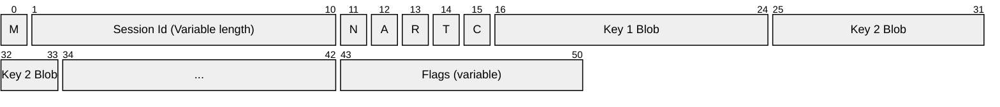
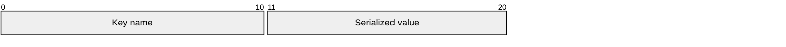
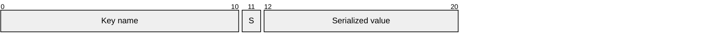

# Session serialization

Session serialization is provided through the `ISessionSerializer` type. There are two modes that are available:

## Common structure

Where:
- *M*: Mode
- *N*: New session
- *A*: Abandoned
- *R*: Readonly
- *T*: Timeout
- *C*: Key count

## Flags

Flags allow for additional information to be sent either direction that may not be known initially. This field was added v2 but is backwards compatible with the v1 deserializer and will operate as a no-op as it just reads the things it knows about and doesn't look for the end of a payload.

Structure:

Where:
- *Fn*: Flag `n`

Where `C` is the count of flags, and each `Fn` is a flag identifier an int with 7bit encoding. Each f

An example is the flag section used to indicate that there is support for diffing a session state on the server:

## Full Copy (Mode = 1)

The following is the structure of the key blobs when the full state is serialized:

## Diffing Support (Mode = 2)

The following is the structure of the key blobs when only the difference is serialized:

Where:
- *S*: A value indicating the change the key has undergone from the values in `SessionItemChangeState`

