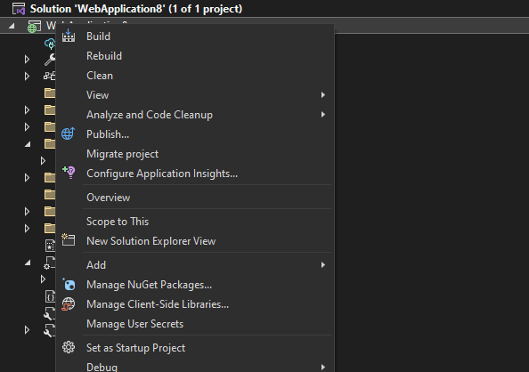
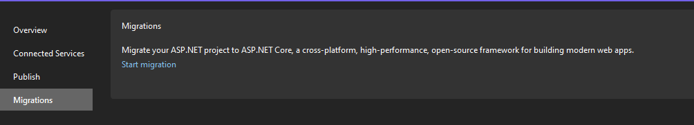
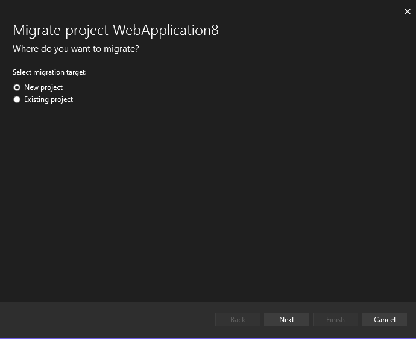

# Getting Started

In order to start a large migration, we recommend setting up a ASP.NET Core application that will proxy to the original .NET Framework Application. This set up will look like this:

To understand how this is helpful in the migration process, please refer to the [introduction](README.md). The rest of this document will provide the steps to set this up and how to proceed with an incremental migration.

## Set up ASP.NET Core Project

1. Install this [experimental Visual Studio extension](https://marketplace.visualstudio.com/items?itemName=WebToolsTeam.aspnetprojectmigrations) that will help configure the solution.
2. Right click the ASP.NET Framework application and select "Migrate Project":
   
3. This will open a menu that will offter to start a migration. Click the link to begin:
   
4. A wizard will now appear that allows you to create a new project or select an existing project.
   
5. After completing the wizard, you will now have an ASP.NET Core project that will proxy requests that do not exist there onto the ASP.NET Framework application.

## Upgrade supporting libraries

If you have supporting libraries in your solution that you will need to use, they should be upgraded to support .NET 6. [Upgrade Assistant](https://github.com/dotnet/upgrade-assistant) is a great tool for this.

The adapters in this project can be used in these libraries to enable support for `System.Web.HttpContext` usage that you may have in class libraries. In order to enable this in a library:

1. Remove reference to `System.Web` in the project file
2. Add the `Microsoft.AspNetCore.SystemWebAdapters` package
3. Enable multi-targeting and add a .NET 6 target, or convert the project to .NET Standard

This step may require a number of projects to change depending on your solution structure. Upgrade Assistant can help you identify which ones need to change and automate a number of steps in the process.

## Enable Session Support

Session is a commonly used feature of ASP.NET that shares a name with a feature in ASP.NET Core but that's where the similarity ends. Please see the documentation on [session support](session-state/session.md) to understand how to use it.

## Enable shared authentication support

While migrating endpoints from an ASP.NET app to an ASP.NET Core app, it is desirable to enable the user to log in to the application once (if authentication is supported) and for that identity to be available to both the ASP.NET and ASP.NET Core app so that the user's experience with the site works as it would if all endpoints were served from the same project. In order to enable this, the System.Web adapters expose [remote authentication features](remote-authentication/remote-authentication.md) for deferring authentication to the ASP.NET app and sharing the user's ClaimsPrincipal between both apps.

## General Usage Guidance

There are a number of differences between ASP.NET and ASP.NET Core that the adapters are able to smooth over. However, there are some features that require an opt-in as it will incur some cost. There are also behavior that cannot be adapted. Please see [usage guidance](usage_guidance.md) to see a list of these.
