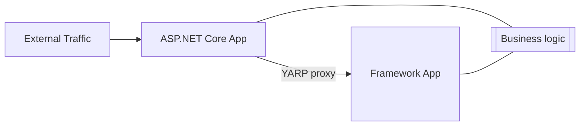
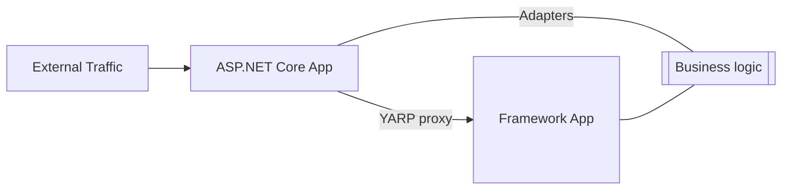
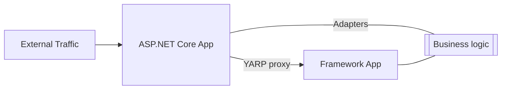

# System.Web Adapters

Migrating an application from ASP.NET Framework to ASP.NET Core is a non-trivial action for the majority of large applications. These applications have often grown organically over time, incorporating new technologies as they come and are often composed of many legacy decisions. The aim of this repo is to provide tools and support for migrating these large applications with as little change as possible to ASP.NET Core.

One of the larger challenges is the pervasive use of `System.Web.HttpContext` throughout a code base to access information about a request or update a response. Until now, in order to move forward, a large scale rewrite was required to remove this dependency. Now, the adapters in this repo provide a set of runtime helpers to access the types your code is expecting but in a way that will work on ASP.NET Core with little change.

A complete mgiration may take a while (sometimes a multi-year effort) depending on the size of the application. In order to continue deploying an application to production while working on migrating, the best pattern is to follow is the [Strangler Fig pattern](https://docs.microsoft.com/en-us/azure/architecture/patterns/strangler-fig). This pattern allows for continual development on the old system with an incremental approach to moving foward. This document will describe how to apply that pattern to an ASP.NET app migrating towards ASP.NET Core.

## Migration Journey

When starting a migration journey, the application will be targeting ASP.NET Framework and running on Windows with its supporting libraries:

The first step is to introduce a new application based on ASP.NET Core that will become the entry point. Traffic will enter the core app and if the core app cannot match a route, it will proxy the request onto the framework app via [YARP](https://microsoft.github.io/reverse-proxy/) and serve a response as the application has already been doing. Majority of code will continue to be in the framework app, but the core app is now set up to start migrating routes to:

In order to start moving over business logic that relies on `HttpContext`, the libraries need to be built against `Microsoft.AspNetCore.SystemWebAdapters`. This will ensure that the libraries are using surface area that is available on both ASP.NET and ASP.NET Core:

At this point, the journey is to focus on moving routes over one at a time. This could be WebAPI or MVC controllers (or even a single method from a controller), ASPX pages, handlers, or some other implementation of a route. If the route is available in the core app, it will then be matched and served from there. Over time, the core app will start processing more of the routes served than the framework app:

Once the framework app is no longer needed, it may be removed:

At this point, the application as a whole is running on the ASP.NET Core application stack, but is still using the adapters from this repo. At this point, the goal will be to remove the use of the adapters until the application is relying solely on the ASP.NET Core application framework:

## System.Web Adapters

The `Microsoft.AspNetCore.SystemWebAdapters` is a collection of runtime helpers that will facillitate using old core written against `System.Web` while moving onto ASP.NET Core.

The heart of the library is support for `System.Web.HttpContext`. This attempts to provide compatible behavior for what is found running on ASP.NET to expedite moving onto ASP.NET Core. There are a number of behaviors that ASP.NET provided that incur a performance cost if enabled on ASP.NET Core so must be opted into. For details, see [here](./metadata.md).

For guidance around usage, please see [here](usage_guidance.md).

