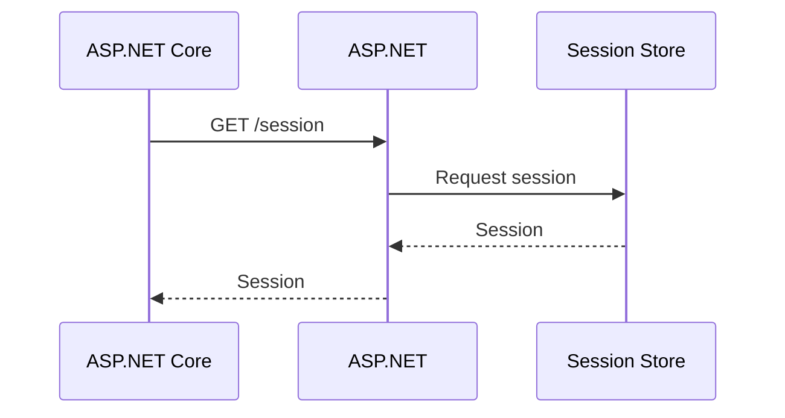
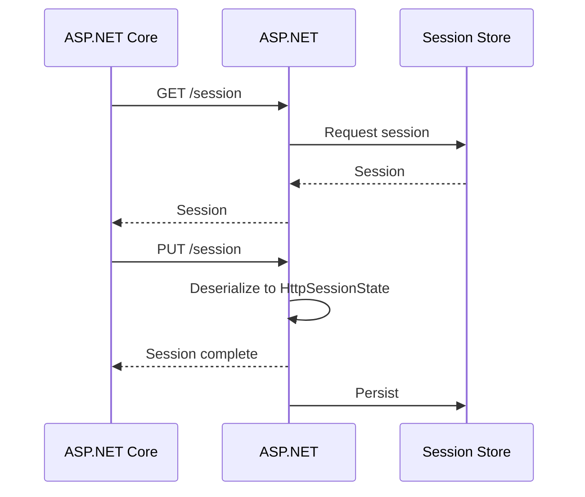

# Remote App Session State

Remote app session state will enable communication between the ASP.NET Core and ASP.NET app and to retrieve the session state. This is enabled by exposing an endpoint on the ASP.NET app that can be queried to retrieve and set the session state.

# HttpSessionState serialization

The `System.Web.SessionState.HttpSessionState` object must be serialized for remote app session state to be enabled. This is accomplished through implementation of the type `Microsoft.AspNetCore.SysteWebAdapters.SessionState.Serialization.ISessionSerializer`, of which a default binary writer implementation is provided. This is added by the following code:

```csharp
builder.Services.AddSystemWebAdapters()
    .AddSessionSerializer(options =>
    {
        // Customize session serialization here
    });
```

## Configuration

In order to configure it, both the framework and core app must set an API key as well as register known app settings types. These properties are:

- `ApiKeyHeader` - header name that will contain an API key to secure the endpoint added on .NET Framework
- `ApiKey` - the shared API key that will be validated in the .NET Framework handler

Configuration for ASP.NET Core would look similar to the following:

```csharp
builder.Services.AddSystemWebAdapters()
<<<<<<< HEAD
    .AddRemoteAppClient(remote => remote
        .Configure(options =>
        {
            options.RemoteAppUrl = new(builder.Configuration["ReverseProxy:Clusters:fallbackCluster:Destinations:fallbackApp:Address"]);
            options.ApiKey = ClassLibrary.RemoteServiceUtils.ApiKey;
        })
        .AddSession())
=======
    .AddRemoteApp(options =>
    {
        // Provide the URL for the remote app that has enabled session querying
        options.RemoteApp = new(builder.Configuration["ReverseProxy:Clusters:fallbackCluster:Destinations:fallbackApp:Address"]);

        // Provide a strong API key that will be used to authenticate the request on the remote app for querying the session
        options.ApiKey = "strong-api-key";
    })
    .AddRemoteAppSession()
>>>>>>> origin/main
    .AddJsonSessionSerializer(options =>
    {
        // Serialization/deserialization requires each session key to be registered to a type
        options.RegisterKey<int>("test-value");
        options.RegisterKey<SessionDemoModel>("SampleSessionItem");
    });
```

Session support requires additional work for the ASP.NET Core pipeline, and is not turned on by default. It can be configured on a per-route basis via ASP.NET Core metadata.

For example, session support requires either to annotate a controller:

```cs
[Session]
public class SomeController : Controller
{
}
```

or to enable for all endpoints by default:

```cs
app.MapDefaultControllerRoute()
    .RequireSystemWebAdapterSession();
```


The framework equivalent would look like the following change in `Global.asax.cs`:

```csharp
SystemWebAdapterConfiguration.AddSystemWebAdapters(this)
<<<<<<< HEAD
    .AddProxySupport(options => options.UseForwardedHeaders = true)
=======
    // Provide a strong API key that will be used to authenticate the request on the remote app for querying the session
    .AddRemoteApp(options => options.ApiKey = "strong-api-key")
    .AddRemoteAppSession()
>>>>>>> origin/main
    .AddJsonSessionSerializer(options =>
    {
        // Serialization/deserialization requires each session key to be registered to a type
        options.RegisterKey<int>("test-value");
        options.RegisterKey<SessionDemoModel>("SampleSessionItem");
<<<<<<< HEAD
    })
    .AddRemoteAppServer(remote => remote
        .Configure(options => options.ApiKey = ClassLibrary.RemoteServiceUtils.ApiKey)
        .AddSession());
=======
    });
>>>>>>> origin/main
```
# Protocol

## Readonly
Readonly session will retrieve the session state from the framework app without any sort of locking. This consists of a single `GET` request that will return a session state and can be closed immediately.



## Writeable

Writeable session state protocol starts with the the same as the readonly, but differs in the following:

- Requires an additional `PUT` request to update the state
- The initial `GET` request must be kept open until the session is done; if closed, the session will not be able to be updated


