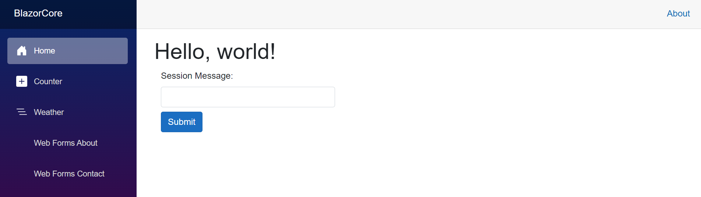
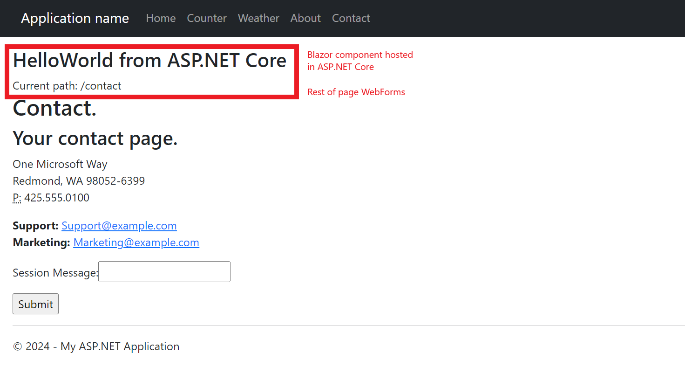

# WebForms Migration to Blazor

Migrating WebForms to .NET Core is not a straightforward approach. This sample shows how:
- Incremental migration can be used to start migrating to Blazor by using Blazor pages for completed routes and Blazor components in the WebForms project for controls. It registers custom components that allows non-Blazor applications to start using Blazor controls.
- Incremental migration can be used to share session state between Blazor and WebForms.

Session (and HttpContext) can only be obtained through Static SSR. See [documentation](https://learn.microsoft.com/en-us/aspnet/core/fundamentals/http-context?view=aspnetcore-8.0#ihttpcontextaccessorhttpcontext-in-razor-components-blazor).

Things to look at in this sample:

- [Program.cs](BlazorCore/Program.cs) and [Global.asax.cs](WebFormsFramework/Global.asax.cs): This is where the remote app session state is initialized for the Blazor and WebForms app respectively. See [documentation](https://learn.microsoft.com/en-us/aspnet/core/migration/inc/remote-session) on how this works.
- [AxdConstraint.cs](BlazorCore/AxdConstraint.cs): An AXD file is a file use by ASP.NET applications for handling embedded resource requests. It contains instructions for retrieving embedded resources, such as images, JavaScript (.JS) files, and .CSS files. AXD files are used for injecting resources into the client-side webpage and access them on the server in a standard way. This constraint allows AXD files to be retrieved from WebForms.
- Using `RegisterCustomElement` to expose a Blazor component in the [ASP.NET Core Project](BlazorCore/Program.cs) that is consumed in the WebForms [SiteMaster](WebFormsFramework/Site.Master#58).

If using NET 6 or 7:
- BlazorEndpointRouteBuilderExtensions: A set of helper methods to enable Blazor to live in the same project as YARP. See [documentation](https://learn.microsoft.com/en-us/aspnet/core/migration/inc/blazor) on how this works.
    > Note: By default, the Blazor project uses `_Host` with a page directive registering it as the root `/` page. If you want `/` to go to the backend app, you'll need to change this page directive to something else. In the sample it is changed to `/blazor-host`

The session can be updated from Blazor on the main page:

The session can be updated from WebForms on the Contact page:

