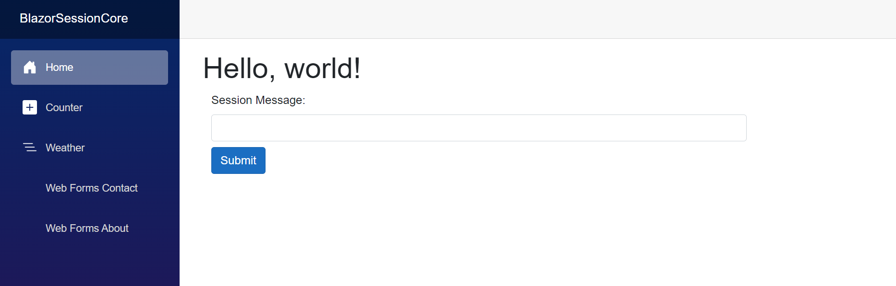
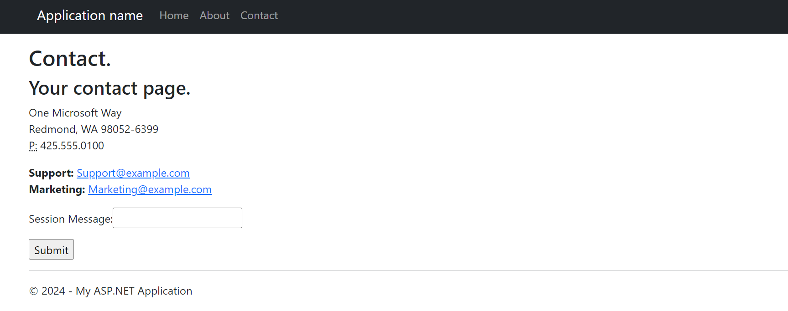

# WebForms Migration to Blazor with Session

Migrating WebForms to .NET Core is not a straightforward approach. This sample shows how the incremental migration can be used to share session state between Blazor and WebForms.

Session (and HttpContext) can only be obtained through Static SSR. See [documentation](https://learn.microsoft.com/en-us/aspnet/core/fundamentals/http-context?view=aspnetcore-8.0#ihttpcontextaccessorhttpcontext-in-razor-components-blazor).

Things to look at in this sample:

- [Program.cs](BlazorSessionCore/Program.cs) and [Global.asax.cs](WebFormsSessionFramework/Global.asax.cs): This is where the remote app session state is initialized for the Blazor and WebForms app respectively. See [documentation](https://learn.microsoft.com/en-us/aspnet/core/migration/inc/remote-session) on how this works.
- [AxdConstraint.cs](BlazorSessionCore/AxdConstraint.cs): An AXD file is a file use by ASP.NET applications for handling embedded resource requests. It contains instructions for retrieving embedded resources, such as images, JavaScript (.JS) files, and.CSS files. AXD files are used for injecting resources into the client-side webpage and access them on the server in a standard way. This constraint allows AXD files to be retrieved from WebForms.

The session can be updated from Blazor on the main page:

The session can be updated from WebForms on the Contact page:

