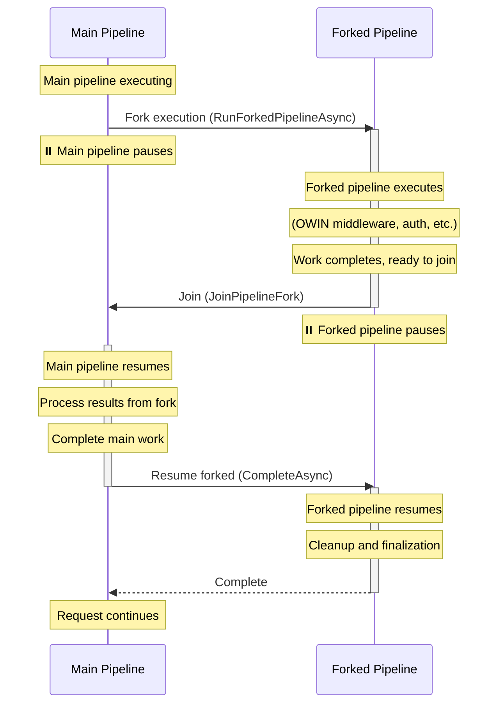

# OWIN Pipeline - Fork/Join Mechanism

## Overview

This document describes the design and implementation of the pipeline fork/join mechanism that enables OWIN middleware to cooperatively yield control back to the ASP.NET Core pipeline. This mechanism is used in two key scenarios:

1. **Integrated Pipeline**: Running OWIN middleware within the emulated `HttpApplication` event lifecycle
2. **Authentication Handler**: Running OWIN authentication middleware as an ASP.NET Core authentication handler

The core mechanism allows the OWIN pipeline to fork at designated points, yield control to the main ASP.NET Core pipeline, and then join back later at the correct point.

## Problem Statement

### Scenario 1: Integrated Pipeline

When integrating OWIN middleware into the emulated `HttpApplication` event pipeline, we need to support the ASP.NET Framework integrated pipeline pattern where:

1. OWIN middleware is organized into stages (e.g., `Authenticate`, `Authorize`, `AcquireState`)
2. Each stage maps to a specific `HttpApplication` event (e.g., `AuthenticateRequest`, `AuthorizeRequest`)
3. The OWIN pipeline must fork at stage boundaries to allow the `HttpApplication` event handlers to execute
4. After the event completes, the OWIN pipeline must join back and continue from where it forked

### Scenario 2: Authentication Handler

When using OWIN middleware as an ASP.NET Core authentication handler, we need to:

1. Run OWIN authentication middleware (e.g., cookie authentication, OAuth) within the handler
2. Allow the OWIN middleware to perform authentication and set the user principal
3. Return control to ASP.NET Core's authentication system after authentication completes
4. Support both authentication and challenge/sign-out operations

### Common Challenge

Both scenarios require interleaving OWIN middleware execution with ASP.NET Core pipeline execution while maintaining proper async control flow and ensuring the outgoing flow of the middleware occurs at the end of the request.

## High-Level Architecture

The solution uses a **pipeline fork/join pattern** with cooperative multitasking between two concurrent execution paths:

- **Main Pipeline**: The ASP.NET Core middleware pipeline (or authentication handler)
- **Forked Pipeline**: The OWIN middleware pipeline

This shows the fundamental fork/join coordination pattern used by both the integrated pipeline and authentication handler scenarios:

### Key Steps

1. **Fork**: Initiated manually

2. **Join**: Called at the final piece of middleware to yield control back to the main pipeline

3. **Resume Forked**: Scheduled to run at the end of the request finalization in reverse order so that the middleware cleanup order is correct
